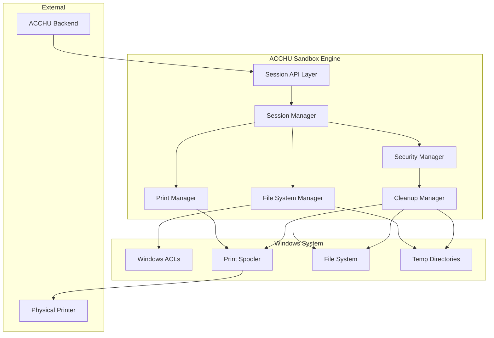

# Design Document: ACCHU Sandbox Engine

## Overview

The ACCHU Sandbox Engine is a Windows-based secure document processing system that creates ephemeral, isolated workspaces for customer print jobs. The system implements a fail-closed security model where any failure results in immediate session termination and data cleanup. The architecture prioritizes data isolation, secure cleanup, and prevention of data residue through multiple layers of security controls.

The system will be implemented as a Windows service using .NET 8 with C#, leveraging Windows ACLs for access control, the Print Spooler API for print management, and secure deletion techniques for data destruction. The service operates with elevated privileges to manage system resources while maintaining strict isolation between customer sessions.

## Architecture

The system follows a layered architecture with clear separation of concerns:



### Component Responsibilities

- **Session API Layer**: Handles communication with ACCHU Backend, validates requests
- **Session Manager**: Orchestrates session lifecycle, maintains state, enforces business rules
- **File System Manager**: Creates sandboxes, manages file operations, enforces ACLs
- **Print Manager**: Interfaces with Windows Print Spooler, enforces print constraints
- **Cleanup Manager**: Performs secure deletion, clears system caches, validates cleanup
- **Security Manager**: Validates tokens, enforces fail-closed behavior, logs security events

## Components and Interfaces

### Session Manager

The Session Manager is the central orchestrator that maintains session state and coordinates between all other components.

```csharp
public interface ISessionManager
{
    Task<SessionResult> StartSessionAsync(SessionRequest request);
    Task<SessionResult> EndSessionAsync(string sessionId);
    Task<SessionResult> ProcessFileAsync(string sessionId, FileRequest fileRequest);
    Task<PrintResult> ExecutePrintJobAsync(string sessionId, PrintJobDescriptor descriptor);
    SessionStatus GetSessionStatus(string sessionId);
    Task InvalidateSessionAsync(string sessionId, string reason);
}

public class SessionRequest
{
    public string SessionId { get; set; }
    public string SessionToken { get; set; }
    public DateTime ExpirationTime { get; set; }
    public Dictionary<string, object> Metadata { get; set; }
}

public class SessionResult
{
    public bool Success { get; set; }
    public string SessionId { get; set; }
    public string ErrorMessage { get; set; }
    public SessionStatus Status { get; set; }
}

public enum SessionStatus
{
    None,
    Active,
    Processing,
    Printing,
    Completed,
    Failed,
    Invalidated
}
```

### File System Manager

Manages sandbox creation, file operations, and ACL enforcement using Windows security APIs.

```csharp
public interface IFileSystemManager
{
    Task<SandboxResult> CreateSandboxAsync(string sessionId);
    Task<FileResult> StoreFileAsync(string sessionId, Stream fileStream, string fileName);
    Task<bool> ValidateFileAsync(string sessionId, string fileName);
    Task<CleanupResult> SecureDeleteAsync(string sessionId);
    Task<bool> VerifyCleanupAsync(string sessionId);
}

public class SandboxResult
{
    public bool Success { get; set; }
    public string SandboxPath { get; set; }
    public string ErrorMessage { get; set; }
    public SecurityIdentifier ServiceSid { get; set; }
}

public class FileResult
{
    public bool Success { get; set; }
    public string FilePath { get; set; }
    public string ErrorMessage { get; set; }
    public long FileSize { get; set; }
    public string FileHash { get; set; }
}
```

### Print Manager

Interfaces with Windows Print Spooler API and enforces print job constraints.

```csharp
public interface IPrintManager
{
    Task<PrintResult> SubmitPrintJobAsync(string sessionId, PrintJobDescriptor descriptor);
    Task<PrintStatus> GetPrintStatusAsync(string sessionId, int jobId);
    Task<bool> CancelPrintJobAsync(string sessionId, int jobId);
    Task<CleanupResult> ClearPrintSpoolerAsync(string sessionId);
}

public class PrintJobDescriptor
{
    public string FileName { get; set; }
    public int Copies { get; set; }
    public bool ColorPrinting { get; set; }
    public bool DoubleSided { get; set; }
    public string PrinterName { get; set; }
    public Dictionary<string, object> PrintSettings { get; set; }
}

public class PrintResult
{
    public bool Success { get; set; }
    public int JobId { get; set; }
    public string ErrorMessage { get; set; }
    public PrintStatus Status { get; set; }
}

public enum PrintStatus
{
    Queued,
    Printing,
    Completed,
    Failed,
    Cancelled
}
```

### Security Manager

Handles token validation, security logging, and fail-closed enforcement.

```csharp
public interface ISecurityManager
{
    Task<ValidationResult> ValidateSessionTokenAsync(string sessionToken);
    Task<ValidationResult> ValidateFileSourceAsync(Stream fileStream, string expectedSource);
    Task LogSecurityEventAsync(SecurityEvent securityEvent);
    Task<bool> EnforceFailClosedAsync(string sessionId, string failureReason);
}

public class ValidationResult
{
    public bool IsValid { get; set; }
    public string ErrorMessage { get; set; }
    public DateTime ValidUntil { get; set; }
    public Dictionary<string, object> Claims { get; set; }
}

public class SecurityEvent
{
    public string SessionId { get; set; }
    public SecurityEventType EventType { get; set; }
    public string Description { get; set; }
    public DateTime Timestamp { get; set; }
    public Dictionary<string, object> Details { get; set; }
}

public enum SecurityEventType
{
    SessionStarted,
    SessionEnded,
    FileReceived,
    PrintJobSubmitted,
    SecurityViolation,
    CleanupCompleted,
    SessionInvalidated
}
```

### Cleanup Manager

Performs secure deletion and system cleanup operations.

```csharp
public interface ICleanupManager
{
    Task<CleanupResult> PerformFullCleanupAsync(string sessionId);
    Task<CleanupResult> SecureDeleteFilesAsync(string sandboxPath);
    Task<CleanupResult> ClearPrintSpoolerAsync(string sessionId);
    Task<CleanupResult> ClearTemporaryCachesAsync(string sessionId);
    Task<bool> VerifyNoDataResidueAsync(string sessionId);
}

public class CleanupResult
{
    public bool Success { get; set; }
    public string ErrorMessage { get; set; }
    public List<string> CleanedItems { get; set; }
    public List<string> FailedItems { get; set; }
    public int OverwritePasses { get; set; }
}
```

## Data Models

### Session State Model

```csharp
public class SessionState
{
    public string SessionId { get; set; }
    public string SessionToken { get; set; }
    public SessionStatus Status { get; set; }
    public DateTime CreatedAt { get; set; }
    public DateTime ExpiresAt { get; set; }
    public string SandboxPath { get; set; }
    public List<SessionFile> Files { get; set; }
    public List<PrintJob> PrintJobs { get; set; }
    public Dictionary<string, object> Metadata { get; set; }
}

public class SessionFile
{
    public string FileName { get; set; }
    public string FilePath { get; set; }
    public long FileSize { get; set; }
    public string FileHash { get; set; }
    public DateTime ReceivedAt { get; set; }
    public FileStatus Status { get; set; }
}

public enum FileStatus
{
    Received,
    Validated,
    Ready,
    Printing,
    Printed,
    Deleted
}

public class PrintJob
{
    public int JobId { get; set; }
    public string FileName { get; set; }
    public PrintJobDescriptor Descriptor { get; set; }
    public PrintStatus Status { get; set; }
    public DateTime SubmittedAt { get; set; }
    public DateTime CompletedAt { get; set; }
}
```

### Configuration Model

```csharp
public class SandboxConfiguration
{
    public string TempDirectoryRoot { get; set; }
    public int MaxSessionDurationMinutes { get; set; }
    public int MaxFileSizeBytes { get; set; }
    public List<string> AllowedFileTypes { get; set; }
    public int SecureDeletionPasses { get; set; }
    public bool EnableAuditLogging { get; set; }
    public string ServiceAccountName { get; set; }
}

public class PrintConfiguration
{
    public string DefaultPrinterName { get; set; }
    public int MaxCopiesAllowed { get; set; }
    public bool AllowColorPrinting { get; set; }
    public bool AllowDoubleSided { get; set; }
    public int PrintTimeoutSeconds { get; set; }
}
```

## Correctness Properties

*A property is a characteristic or behavior that should hold true across all valid executions of a system—essentially, a formal statement about what the system should do. Properties serve as the bridge between human-readable specifications and machine-verifiable correctness guarantees.*

Based on the prework analysis, I've identified the following testable properties that validate the system's correctness:

### Property 1: Unique Sandbox Creation
*For any* new print session, creating a sandbox workspace should result in a unique identifier and isolated directory that is inaccessible to unauthorized users and uses proper Windows ACLs for the service account only.
**Validates: Requirements 1.1, 1.2, 1.3, 1.4, 1.5**

### Property 2: Authorized File Reception
*For any* file reception attempt, the system should accept the file if and only if it has valid backend origin, matching session ID, and valid print job descriptor.
**Validates: Requirements 2.1, 2.2, 2.3**

### Property 3: Unauthorized File Rejection
*For any* unauthorized file (wrong source, invalid session, missing descriptor, or manual import), the system should reject the file and log a security violation.
**Validates: Requirements 2.4, 2.5**

### Property 4: Print Job Descriptor Parsing
*For any* valid JSON print job descriptor, the system should correctly parse and extract all print parameters (copies, color, duplex settings).
**Validates: Requirements 3.1**

### Property 5: Print Parameter Enforcement
*For any* print job with specified parameters, the system should enforce exactly the number of copies, color settings, and duplex settings from the descriptor.
**Validates: Requirements 3.2, 3.3, 3.4**

### Property 6: Action Restriction
*For any* user interaction with the system, only print actions should be available, with save, copy, and export operations prevented.
**Validates: Requirements 3.5**

### Property 7: Parameter Violation Response
*For any* attempt to violate or modify print parameters, the system should abort the print job and invalidate the session.
**Validates: Requirements 3.6**

### Property 8: Automatic Cleanup Triggering
*For any* session completion (successful print, manual end, or crash recovery), the system should automatically trigger cleanup procedures.
**Validates: Requirements 4.1, 4.2, 4.3**

### Property 9: Comprehensive Cleanup Execution
*For any* cleanup operation, the system should securely delete all sandbox files, clear print spooler entries, clear temporary caches, and invalidate session tokens.
**Validates: Requirements 4.5, 4.6, 4.7, 4.8**

### Property 10: Data Residue Verification
*For any* completed cleanup operation, scanning the system should find no remaining data residue from the session.
**Validates: Requirements 4.9**

### Property 11: Fail-Closed Session Invalidation
*For any* security validation failure, file system error, print spooler error, or network communication failure, the system should immediately invalidate the current session.
**Validates: Requirements 5.1, 5.2, 5.3, 5.4**

### Property 12: Security Event Logging
*For any* security failure or violation, the system should create appropriate audit logs while protecting customer data privacy.
**Validates: Requirements 5.6**

### Property 13: File Content Security Validation
*For any* file submission, the system should reject executable files, validate file headers match declared types, prevent code execution operations, and only accept whitelisted file types.
**Validates: Requirements 6.1, 6.2, 6.4, 6.5**

### Property 14: Print System Integration
*For any* print job submission, the job should appear in the Windows print spooler and be properly tracked through the printing system.
**Validates: Requirements 7.1, 7.5**

### Property 15: Printer Status Handling
*For any* printer status change (offline/online), the system should handle the change gracefully and provide appropriate error messages for failures.
**Validates: Requirements 7.3, 7.4**

### Property 16: Session Exclusivity
*For any* time period, the system should maintain exactly one active session, rejecting new session requests when another session is active.
**Validates: Requirements 8.1, 8.2**

### Property 17: Session State Tracking
*For any* session state transition, the system should log the transition for audit purposes and provide accurate status indicators to authorized operators.
**Validates: Requirements 8.3, 8.4**

### Property 18: Cryptographic Session Enforcement
*For any* session operation, session boundaries should be cryptographically enforced through proper session token validation.
**Validates: Requirements 8.5**

## Error Handling

The system implements a comprehensive error handling strategy based on the fail-closed security model:

### Error Categories and Responses

1. **Security Violations**: Immediate session invalidation, security logging, cleanup initiation
2. **File System Errors**: Session invalidation, cleanup attempt, error logging
3. **Print System Errors**: Session invalidation, print queue clearing, error logging
4. **Network Errors**: Session invalidation during critical operations, retry for non-critical operations
5. **System Resource Errors**: Graceful degradation where possible, session invalidation for critical failures

### Error Recovery Mechanisms

- **Crash Recovery**: On startup, scan for orphaned sessions and perform cleanup
- **Resource Cleanup**: Automatic cleanup of system resources on any error condition
- **Audit Trail**: Complete logging of all error conditions for forensic analysis
- **User Notification**: Clear error messages that don't expose sensitive system details

### Timeout Handling

- **Session Timeout**: Automatic session invalidation after configured duration
- **Print Timeout**: Print job cancellation and session cleanup after timeout
- **Network Timeout**: Graceful handling of backend communication timeouts

## Testing Strategy

The ACCHU Sandbox Engine requires a dual testing approach combining unit tests for specific scenarios and property-based tests for comprehensive validation:

### Unit Testing Approach

Unit tests will focus on:
- **Specific Integration Points**: Testing Windows API interactions, print spooler integration
- **Edge Cases**: Empty files, malformed JSON descriptors, invalid file types
- **Error Conditions**: Network failures, file system errors, printer offline scenarios
- **Security Boundaries**: Testing ACL enforcement, token validation, file source verification

### Property-Based Testing Approach

Property-based tests will validate universal correctness properties using a minimum of 100 iterations per test. The testing framework will use **Hypothesis** for Python components and **FsCheck** for .NET components.

Each property test will:
- Generate random valid inputs within defined constraints
- Execute the system operation
- Verify the expected property holds
- Tag tests with format: **Feature: acchu-sandbox-engine, Property {number}: {property_text}**

### Test Configuration

- **Minimum Iterations**: 100 per property test
- **Test Environment**: Isolated Windows test environment with mock printers
- **Security Testing**: Dedicated security test suite with privilege escalation attempts
- **Performance Testing**: Load testing for concurrent session attempts and large file handling
- **Integration Testing**: End-to-end testing with mock ACCHU backend

### Test Data Management

- **Synthetic Test Files**: Generated test documents of various types and sizes
- **Mock Print Jobs**: Simulated print job descriptors with various parameter combinations
- **Security Test Cases**: Malicious file samples, invalid tokens, unauthorized access attempts
- **Cleanup Verification**: Forensic scanning tools to verify complete data removal

The testing strategy ensures that both specific use cases and general system properties are thoroughly validated, providing confidence in the system's security and reliability.