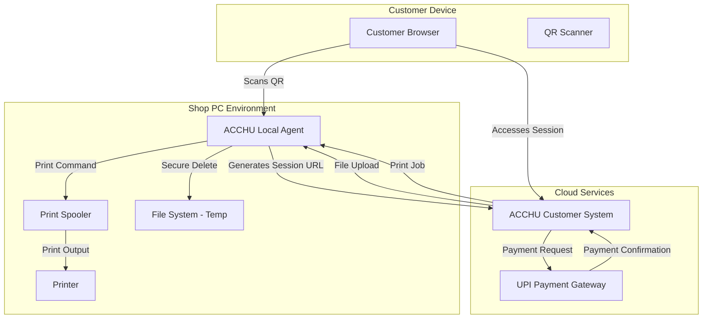

# Design Document: SecurePrint Session (SPS)

## Overview

SecurePrint Session (SPS) is a dual-component system designed to provide secure, ephemeral printing services in public PC environments. The system consists of a Windows desktop application (ACCHU Local Agent) running on shop PCs and a web-based customer interface (ACCHU Customer System) accessed via QR codes.

The architecture follows zero-trust principles with fail-closed design, ensuring that any system failure results in immediate session termination and data destruction. All customer data exists only in memory and temporary storage during active sessions, with multi-pass secure deletion ensuring no data persistence.

Key design principles:
- **Session Isolation**: Each customer interaction occurs in a completely isolated session context
- **Ephemeral Data**: No customer data persists beyond session lifetime
- **Fail-Closed Security**: System failures invalidate all sessions and destroy data
- **Minimal Attack Surface**: Limited network exposure and no permanent data storage

## Architecture

### System Components



### Communication Flow

1. **Session Initiation**: Local Agent generates unique session ID and QR code
2. **Customer Access**: QR code contains session-specific URL to Customer System
3. **File Transfer**: Customer uploads files directly to Local Agent via web interface
4. **Payment Processing**: Customer System handles UPI payment verification
5. **Print Execution**: Local Agent receives print command and executes job
6. **Session Cleanup**: Automatic secure deletion of all session data

### Security Architecture

The system implements defense-in-depth security:

- **Network Layer**: HTTPS-only communication, session-specific URLs
- **Application Layer**: Session isolation, input validation, secure file handling
- **Data Layer**: In-memory processing, secure deletion, no persistent storage
- **Physical Layer**: Local execution prevents data exfiltration

## Components and Interfaces

### ACCHU Local Agent (Desktop Application)

**Technology Stack**: Electron with Node.js backend for cross-platform compatibility while maintaining Windows focus.

**Core Responsibilities**:
- Session lifecycle management
- QR code generation using `qrcode` library
- File reception and temporary storage
- Print job execution via Windows Print Spooler API
- Secure file deletion using multi-pass overwriting

**Key Interfaces**:

```typescript
interface SessionManager {
  createSession(): SessionId
  getSessionStatus(sessionId: SessionId): SessionStatus
  terminateSession(sessionId: SessionId): void
  cleanupOrphanedSessions(): void
}

interface FileHandler {
  receiveFile(sessionId: SessionId, file: FileData): Promise<FileId>
  validateFile(file: FileData): ValidationResult
  secureDelete(sessionId: SessionId): Promise<void>
}

interface PrintManager {
  queuePrintJob(sessionId: SessionId, options: PrintOptions): JobId
  executePrintJob(jobId: JobId): Promise<PrintResult>
  getPrinterStatus(): PrinterStatus
}
```

**Session Storage Structure**:
```
%TEMP%/acchu-sessions/
├── {session-id}/
│   ├── files/
│   │   ├── {file-id}.pdf
│   │   └── {file-id}.docx
│   ├── metadata.json
│   └── print-job.json
```

### ACCHU Customer System (Web Application)

**Technology Stack**: React.js frontend with Node.js/Express backend, deployed on cloud infrastructure.

**Core Responsibilities**:
- Session validation and customer interface
- File upload handling with progress tracking
- Print option configuration and pricing calculation
- UPI payment integration
- Real-time status updates

**Key Interfaces**:

```typescript
interface CustomerSession {
  validateSession(sessionId: SessionId): Promise<SessionInfo>
  uploadFile(sessionId: SessionId, file: File): Promise<UploadResult>
  configurePrint(sessionId: SessionId, options: PrintOptions): Promise<PriceQuote>
  processPayment(sessionId: SessionId, amount: number): Promise<PaymentResult>
}

interface PaymentGateway {
  generateUPIRequest(amount: number, sessionId: SessionId): UPIRequest
  verifyPayment(transactionId: string): Promise<PaymentStatus>
}
```

### Communication Protocol

**Session URL Format**:
```
https://customer.acchu.com/session/{session-id}?token={auth-token}&shop={shop-id}
```

**API Endpoints**:
- `GET /api/session/{sessionId}` - Validate session and get status
- `POST /api/session/{sessionId}/upload` - Upload files
- `POST /api/session/{sessionId}/configure` - Set print options
- `POST /api/session/{sessionId}/payment` - Process payment
- `POST /api/session/{sessionId}/print` - Trigger print job

**WebSocket Events** (for real-time updates):
- `session-status` - Session state changes
- `upload-progress` - File upload progress
- `print-status` - Print job progress
- `session-ended` - Session termination

## Data Models

### Session Model

```typescript
interface Session {
  id: SessionId              // UUID v4
  shopId: string            // Shop identifier
  status: SessionStatus     // active | printing | completed | terminated
  createdAt: Date
  expiresAt: Date           // 30 minutes from creation
  files: FileMetadata[]
  printJob?: PrintJob
  paymentStatus: PaymentStatus
}

enum SessionStatus {
  ACTIVE = 'active',
  PRINTING = 'printing', 
  COMPLETED = 'completed',
  TERMINATED = 'terminated'
}
```

### File Model

```typescript
interface FileMetadata {
  id: FileId                // UUID v4
  originalName: string
  mimeType: string
  size: number             // bytes
  uploadedAt: Date
  localPath: string        // temporary file path
  pageCount?: number       // for printable files
}

interface FileData {
  buffer: Buffer
  metadata: FileMetadata
}
```

### Print Job Model

```typescript
interface PrintJob {
  id: JobId                // UUID v4
  sessionId: SessionId
  files: FileId[]
  options: PrintOptions
  pricing: PriceBreakdown
  status: JobStatus
  createdAt: Date
  executedAt?: Date
}

interface PrintOptions {
  copies: number           // 1-10
  colorMode: 'color' | 'bw'
  duplex: boolean
  paperSize: 'A4' | 'Letter'
}

interface PriceBreakdown {
  totalPages: number
  colorPages: number
  bwPages: number
  basePrice: number        // in paise (₹0.01)
  totalPrice: number       // in paise
}
```

### Payment Model

```typescript
interface PaymentRequest {
  sessionId: SessionId
  amount: number           // in paise
  upiId: string
  transactionId: string
  status: PaymentStatus
  createdAt: Date
  completedAt?: Date
}

enum PaymentStatus {
  PENDING = 'pending',
  COMPLETED = 'completed',
  FAILED = 'failed',
  CANCELLED = 'cancelled'
}
```

### Configuration Model

```typescript
interface ShopConfiguration {
  shopId: string
  pricing: {
    colorPerPage: number   // paise per page
    bwPerPage: number      // paise per page
    duplexDiscount: number // percentage discount
  }
  limits: {
    maxFileSize: number    // bytes
    maxFilesPerSession: number
    sessionTimeout: number // minutes
  }
  printer: {
    defaultPrinter: string
    supportedFormats: string[]
  }
}
```

### Audit Log Model

```typescript
interface AuditEvent {
  id: string
  sessionId: SessionId
  eventType: AuditEventType
  timestamp: Date
  metadata: Record<string, any>
}

enum AuditEventType {
  SESSION_CREATED = 'session_created',
  FILE_UPLOADED = 'file_uploaded',
  PAYMENT_COMPLETED = 'payment_completed',
  PRINT_EXECUTED = 'print_executed',
  SESSION_TERMINATED = 'session_terminated',
  DATA_DESTROYED = 'data_destroyed'
}
```

## Correctness Properties

*A property is a characteristic or behavior that should hold true across all valid executions of a system—essentially, a formal statement about what the system should do. Properties serve as the bridge between human-readable specifications and machine-verifiable correctness guarantees.*

### Property 1: Session Uniqueness and Isolation
*For any* number of concurrent session creation requests, each session should receive a unique identifier and isolated workspace directory with no shared resources between sessions.
**Validates: Requirements 1.1**

### Property 2: Session Timeout Enforcement
*For any* session that remains inactive for 30 minutes, the system should automatically terminate the session and destroy all associated data.
**Validates: Requirements 1.3**

### Property 3: Comprehensive Session Cleanup
*For any* session that ends (manually or automatically), all associated files, metadata, temporary directories, and cached data should be completely destroyed using secure deletion methods.
**Validates: Requirements 1.4, 3.5, 7.1, 7.3**

### Property 4: Crash Recovery Data Destruction
*For any* system restart after a crash, all orphaned session data from previous runs should be detected and immediately destroyed.
**Validates: Requirements 1.5, 7.2**

### Property 5: QR Code Session Binding
*For any* created session, the generated QR code should contain a valid session-specific URL that becomes invalid when the session ends.
**Validates: Requirements 2.1, 2.5**

### Property 6: Session Access Control
*For any* session, only the first successful customer connection should be allowed, with subsequent access attempts being rejected.
**Validates: Requirements 2.4**

### Property 7: File Validation and Storage
*For any* file upload attempt, only files matching supported formats (PDF, DOC, DOCX, JPG, PNG) under 10MB should be accepted and stored in the correct session-specific directory.
**Validates: Requirements 3.1, 3.2**

### Property 8: Print Pricing Calculation
*For any* combination of print options (copies, color mode, duplex), the calculated price should correctly apply the configured rates and discounts.
**Validates: Requirements 4.2, 4.3, 4.4**

### Property 9: Payment-Gated Printing
*For any* print job, execution should only be possible after successful payment verification, and payment failures should not affect uploaded files.
**Validates: Requirements 5.3, 5.4, 6.1**

### Property 10: Secure File Deletion Verification
*For any* session cleanup operation, files should be overwritten multiple times and verification should confirm that data cannot be recovered.
**Validates: Requirements 7.1, 7.5**

### Property 11: Privacy-Preserving Audit Logging
*For any* session event, the system should log required metadata (timestamp, session ID, action type) while never recording customer file names, content, or personal information.
**Validates: Requirements 8.1, 8.2**

### Property 12: Fail-Closed Error Handling
*For any* critical system error, all active sessions should be immediately terminated and their data destroyed to maintain security.
**Validates: Requirements 9.4**

### Property 13: Configuration Validation and Defaults
*For any* configuration update or invalid configuration detection, the system should validate settings and apply safe defaults when necessary without requiring restart.
**Validates: Requirements 10.2, 10.5**

## Error Handling

### Error Categories

**Session Errors**:
- Invalid session access attempts
- Session timeout handling
- Concurrent access violations
- Session data corruption

**File Handling Errors**:
- Unsupported file formats
- File size limit violations
- Upload interruptions
- Secure deletion failures

**Payment Errors**:
- Payment gateway failures
- Transaction verification errors
- Network connectivity issues
- Invalid payment amounts

**Print Errors**:
- Printer offline/unavailable
- Print job failures
- Unsupported print options
- Print queue overflow

**System Errors**:
- Resource exhaustion
- Configuration errors
- Network failures
- Application crashes

### Error Response Strategy

**Fail-Closed Approach**: When critical errors occur, the system prioritizes security over availability by:
1. Immediately terminating affected sessions
2. Destroying all associated data
3. Logging the incident
4. Preventing new session creation until resolved

**Graceful Degradation**: For non-critical errors:
1. Display clear error messages to users
2. Provide retry mechanisms where appropriate
3. Maintain session state when possible
4. Log errors for debugging

**Recovery Procedures**:
1. Automatic orphaned data cleanup on restart
2. Configuration validation and safe defaults
3. Printer status monitoring and reconnection
4. Network retry with exponential backoff

## Testing Strategy

### Dual Testing Approach

The system requires both unit testing and property-based testing for comprehensive coverage:

**Unit Tests** focus on:
- Specific examples and edge cases
- Integration points between components
- Error conditions and boundary values
- Mock payment processing workflows
- UI component behavior

**Property-Based Tests** focus on:
- Universal properties across all inputs
- Session isolation and cleanup verification
- File handling with random inputs
- Pricing calculations with various combinations
- Security properties under different conditions

### Property-Based Testing Configuration

**Testing Framework**: Use `fast-check` for JavaScript/TypeScript property-based testing
**Test Configuration**: Minimum 100 iterations per property test
**Test Tagging**: Each property test must reference its design document property

Tag format: **Feature: secureprint-session, Property {number}: {property_text}**

### Testing Environment Requirements

**Local Agent Testing**:
- Mock printer interfaces for print job testing
- Temporary file system for secure deletion verification
- Session isolation testing with concurrent sessions
- Crash simulation for recovery testing

**Customer System Testing**:
- Mock payment gateway for transaction testing
- File upload testing with various formats and sizes
- Session validation with expired/invalid sessions
- Real-time communication testing

**Integration Testing**:
- End-to-end workflow testing
- Cross-component communication verification
- Error propagation and handling
- Performance testing under load

### Security Testing Requirements

**Penetration Testing**:
- Session hijacking attempts
- File upload security vulnerabilities
- Payment bypass attempts
- Data recovery after deletion

**Privacy Testing**:
- Verify no customer data in logs
- Confirm complete data destruction
- Test session isolation boundaries
- Validate fail-closed behavior

**Performance Testing**:
- Concurrent session handling
- Large file upload performance
- Print queue management
- Resource exhaustion scenarios